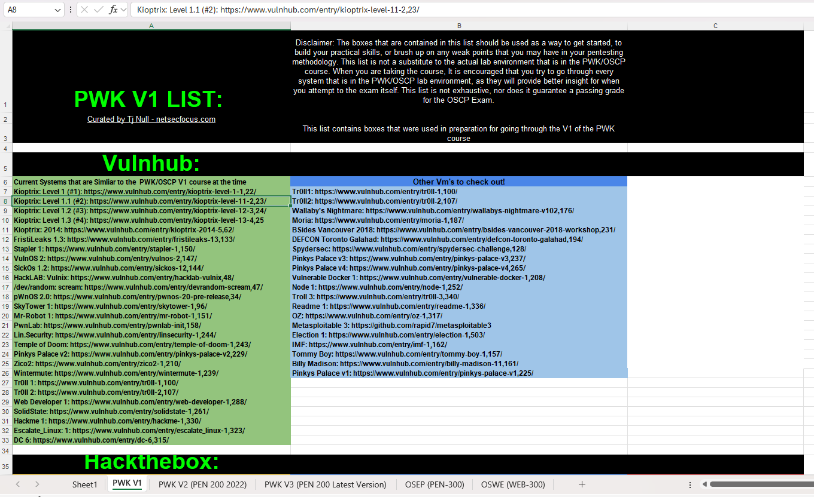

# Introduction

I’m excited to announce that I’m starting my preparation for the OSCP examination! Having recently completed the Altered Security CRTP examination, which was an incredible experience, its motivated me to invest time into my studies. Will probably write about my CRTP Certification and preparation shortly.

My primary source of preparation is [**TJ\_Null's list of Hack The Box OSCP-like VMs**](https://docs.google.com/spreadsheets/u/1/d/1dwSMIAPIam0PuRBkCiDI88pU3yzrqqHkDtBngUHNCw8/htmlview) shown in the below image. I have stated documenting my writeups on how to solve each box on[ **Medium**](https://medium.com/@pramodsrinivasa). Intention of the writeups is to practice my documentation skills as well as a way to review my knowledge before the OSCP exam. I am hoping that this blog would help many others like me in their journey towards OSCP+ Certification.

Hope you enjoy the writeups and feel free to get in touch with me if you have any questions / suggestions!

<figure><figcaption></figcaption></figure>
